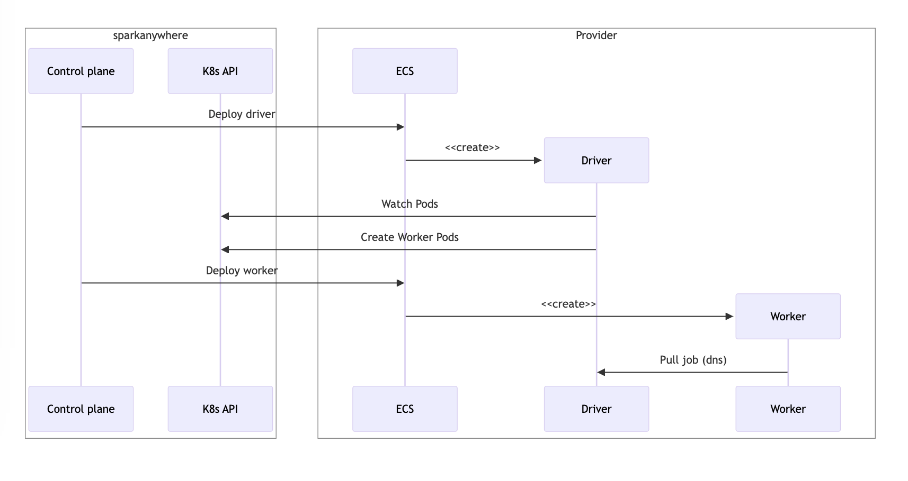

# Sparkanywhere

`Sparkanywhere` is a proof of concept to run Apache Spark multicloud and serverless on top of a container scheduler.

Unlike traditional Spark setups (`Yarn` or `Kubernetes`) that require pre-provisioning and planning of resources, in `sparkanywhere` all the computing resources are provisioned on demand and only for the time that the job is running.

It does not rely on any hosted Spark solution and it can work on top of any service that provides container deployment and inter-service DNS discovery (i.e. `docker`, `aws ecs`).

`Sparkanywhere` deploys the Spark job as a Kubernetes task and [shims]() the Kuberentes API to deploy the Pods (i.e. Spark tasks) on a different container scheduler. Then, if you use as a scheduler a container-as-a-service like ECS, the computation is serverless.

Supported providers:

- [`docker`](): Local Docker provider.
- [`ecs`](): Amazon Elastic Container Service with Fargate.

## Architecture

This is sequence diagram of the system:



## Usage

Clone the repository:

```bash
git git@github.com:ferranbt/sparkanywhere.git
```

The example runs the builtin PI example from Spark with one distributed worker.

### Run with Docker

Run the example using Docker as a scheduler

```bash
go run main.go --docker
```

### Run with ECS

First, you have to create an ECS cluster and a VPC with a public subnet. The tasks must run in a public subnet to pull the public Spark docker images.

```bash
$ cd terraform
$ terraform apply
```

Once it is completed, it should output the name of the cluster, the id of the security group and the id of the public subnet.

```bash
$ terraform output
ecs_cluster_name = "..."
security_group = "..."
subnet = "..."
```

In order for the driver task to find the K8s API of `sparkanywhere`, the binary must be executed in a machine with a reachable IP address (see architecture diagram).

```bash
go run main.go --ecs --ecs-cluster <cluster name> --ecs-security-group <security group id> --ecs-subnet-id <subnet id> --control-plane-address <public ip of sparkanywhere>
```

## Future work

- Add support for other cloud providers like `GCP` or `Azure`.
- Parametrize the Spark job to run.
- Load tasks from S3 buckets.
